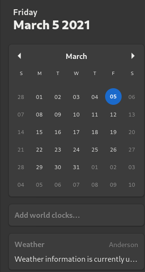

# gnome-minCal-extension

## Description

Updated to work with Gnome 45.

This extension will remove event list and clock/calendar app buttons from the calendar window for Gnome 45 onwards.

This is just an updated version of v2 by breiq and of v3 by mtharpe.

